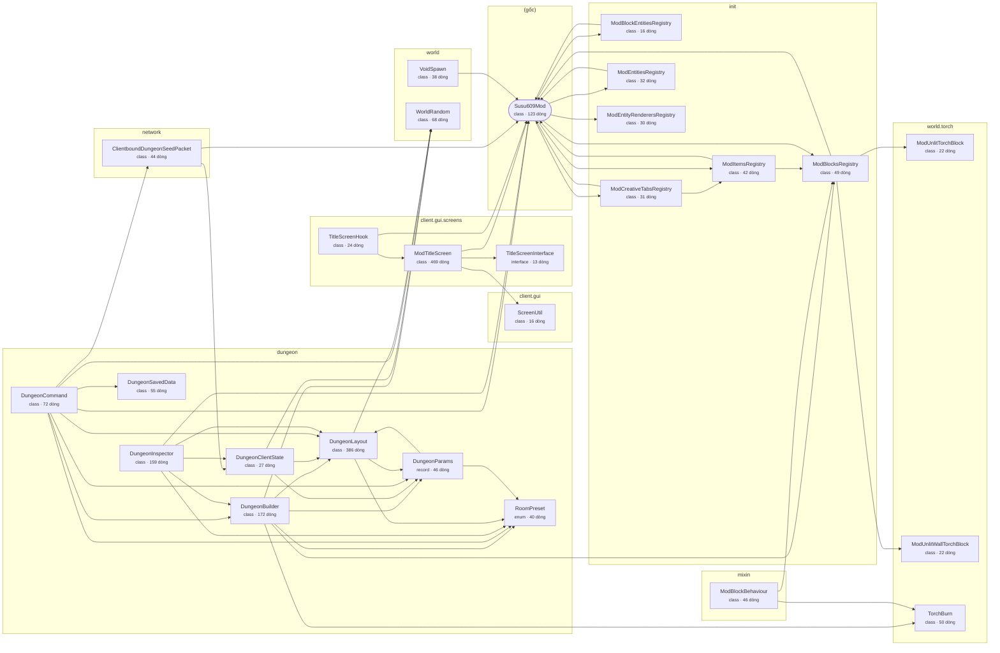

# Kiến trúc mã

> File này được sinh tự động bởi `tools/gen_architecture.py`. Đừng sửa tay.

- Package gốc: `net.susu609.the8dungeon`
- 26 class/kiểu Java, 2092 dòng, 52 phụ thuộc nội bộ

Mũi tên `A --> B` nghĩa là A có dùng tới B. Khối bo tròn là entry point `@Mod`.

```mermaid
flowchart LR
  subgraph pkg__g_c_["(gốc)"]
    Susu609Mod(["Susu609Mod<br/><small>class · 123 dòng</small>"])
  end
  subgraph pkg_client_gui["client.gui"]
    ScreenUtil["ScreenUtil<br/><small>class · 16 dòng</small>"]
  end
  subgraph pkg_client_gui_screens["client.gui.screens"]
    ModTitleScreen["ModTitleScreen<br/><small>class · 469 dòng</small>"]
    TitleScreenHook["TitleScreenHook<br/><small>class · 24 dòng</small>"]
    TitleScreenInterface["TitleScreenInterface<br/><small>interface · 13 dòng</small>"]
  end
  subgraph pkg_dungeon["dungeon"]
    DungeonBuilder["DungeonBuilder<br/><small>class · 172 dòng</small>"]
    DungeonClientState["DungeonClientState<br/><small>class · 27 dòng</small>"]
    DungeonCommand["DungeonCommand<br/><small>class · 72 dòng</small>"]
    DungeonInspector["DungeonInspector<br/><small>class · 159 dòng</small>"]
    DungeonLayout["DungeonLayout<br/><small>class · 386 dòng</small>"]
    DungeonParams["DungeonParams<br/><small>record · 46 dòng</small>"]
    DungeonSavedData["DungeonSavedData<br/><small>class · 55 dòng</small>"]
    RoomPreset["RoomPreset<br/><small>enum · 40 dòng</small>"]
  end
  subgraph pkg_init["init"]
    ModBlockEntitiesRegistry["ModBlockEntitiesRegistry<br/><small>class · 16 dòng</small>"]
    ModBlocksRegistry["ModBlocksRegistry<br/><small>class · 49 dòng</small>"]
    ModCreativeTabsRegistry["ModCreativeTabsRegistry<br/><small>class · 31 dòng</small>"]
    ModEntitiesRegistry["ModEntitiesRegistry<br/><small>class · 32 dòng</small>"]
    ModEntityRenderersRegistry["ModEntityRenderersRegistry<br/><small>class · 30 dòng</small>"]
    ModItemsRegistry["ModItemsRegistry<br/><small>class · 42 dòng</small>"]
  end
  subgraph pkg_mixin["mixin"]
    ModBlockBehaviour["ModBlockBehaviour<br/><small>class · 46 dòng</small>"]
  end
  subgraph pkg_network["network"]
    ClientboundDungeonSeedPacket["ClientboundDungeonSeedPacket<br/><small>class · 44 dòng</small>"]
  end
  subgraph pkg_world["world"]
    VoidSpawn["VoidSpawn<br/><small>class · 38 dòng</small>"]
    WorldRandom["WorldRandom<br/><small>class · 68 dòng</small>"]
  end
  subgraph pkg_world_torch["world.torch"]
    ModUnlitTorchBlock["ModUnlitTorchBlock<br/><small>class · 22 dòng</small>"]
    ModUnlitWallTorchBlock["ModUnlitWallTorchBlock<br/><small>class · 22 dòng</small>"]
    TorchBurn["TorchBurn<br/><small>class · 50 dòng</small>"]
  end
  ClientboundDungeonSeedPacket --> DungeonClientState
  ClientboundDungeonSeedPacket --> Susu609Mod
  DungeonBuilder --> DungeonLayout
  DungeonBuilder --> DungeonParams
  DungeonBuilder --> ModBlocksRegistry
  DungeonBuilder --> RoomPreset
  DungeonBuilder --> TorchBurn
  DungeonBuilder --> WorldRandom
  DungeonClientState --> DungeonLayout
  DungeonClientState --> DungeonParams
  DungeonClientState --> WorldRandom
  DungeonCommand --> ClientboundDungeonSeedPacket
  DungeonCommand --> DungeonBuilder
  DungeonCommand --> DungeonLayout
  DungeonCommand --> DungeonParams
  DungeonCommand --> DungeonSavedData
  DungeonCommand --> RoomPreset
  DungeonCommand --> Susu609Mod
  DungeonCommand --> WorldRandom
  DungeonInspector --> DungeonBuilder
  DungeonInspector --> DungeonClientState
  DungeonInspector --> DungeonLayout
  DungeonInspector --> RoomPreset
  DungeonInspector --> Susu609Mod
  DungeonLayout --> DungeonParams
  DungeonLayout --> RoomPreset
  DungeonLayout --> WorldRandom
  DungeonParams --> DungeonLayout
  DungeonParams --> RoomPreset
  ModBlockBehaviour --> ModBlocksRegistry
  ModBlockBehaviour --> TorchBurn
  ModBlockEntitiesRegistry --> Susu609Mod
  ModBlocksRegistry --> ModUnlitTorchBlock
  ModBlocksRegistry --> ModUnlitWallTorchBlock
  ModBlocksRegistry --> Susu609Mod
  ModCreativeTabsRegistry --> ModItemsRegistry
  ModCreativeTabsRegistry --> Susu609Mod
  ModEntitiesRegistry --> Susu609Mod
  ModItemsRegistry --> ModBlocksRegistry
  ModItemsRegistry --> Susu609Mod
  ModTitleScreen --> ScreenUtil
  ModTitleScreen --> Susu609Mod
  ModTitleScreen --> TitleScreenInterface
  Susu609Mod --> ModBlockEntitiesRegistry
  Susu609Mod --> ModBlocksRegistry
  Susu609Mod --> ModCreativeTabsRegistry
  Susu609Mod --> ModEntitiesRegistry
  Susu609Mod --> ModEntityRenderersRegistry
  Susu609Mod --> ModItemsRegistry
  TitleScreenHook --> ModTitleScreen
  TitleScreenHook --> Susu609Mod
  VoidSpawn --> Susu609Mod
```

## Class theo package

### (gốc)

| Class | Loại | Dòng | Dùng tới | Event Forge |
|---|---|---|---|---|
| `Susu609Mod` | class | 123 | ModBlockEntitiesRegistry, ModBlocksRegistry, ModCreativeTabsRegistry, ModEntitiesRegistry, ModEntityRenderersRegistry, ModItemsRegistry | NetworkEvent, NetworkEvent.Context, TickEvent, TickEvent.Phase, TickEvent.ServerTickEvent |

### client.gui

| Class | Loại | Dòng | Dùng tới | Event Forge |
|---|---|---|---|---|
| `ScreenUtil` | class | 16 | - | - |

### client.gui.screens

| Class | Loại | Dòng | Dùng tới | Event Forge |
|---|---|---|---|---|
| `ModTitleScreen` | class | 469 | ScreenUtil, Susu609Mod, TitleScreenInterface | - |
| `TitleScreenHook` | class | 24 | ModTitleScreen, Susu609Mod | ScreenEvent, ScreenEvent.Opening |
| `TitleScreenInterface` | interface | 13 | - | - |

### dungeon

| Class | Loại | Dòng | Dùng tới | Event Forge |
|---|---|---|---|---|
| `DungeonBuilder` | class | 172 | DungeonLayout, DungeonParams, ModBlocksRegistry, RoomPreset, TorchBurn, WorldRandom | - |
| `DungeonClientState` | class | 27 | DungeonLayout, DungeonParams, WorldRandom | - |
| `DungeonCommand` | class | 72 | ClientboundDungeonSeedPacket, DungeonBuilder, DungeonLayout, DungeonParams, DungeonSavedData, RoomPreset, Susu609Mod, WorldRandom | RegisterCommandsEvent |
| `DungeonInspector` | class | 159 | DungeonBuilder, DungeonClientState, DungeonLayout, RoomPreset, Susu609Mod | RegisterGuiOverlaysEvent, RenderLevelStageEvent, RenderLevelStageEvent.Stage |
| `DungeonLayout` | class | 386 | DungeonParams, RoomPreset, WorldRandom | - |
| `DungeonParams` | record | 46 | DungeonLayout, RoomPreset | - |
| `DungeonSavedData` | class | 55 | - | - |
| `RoomPreset` | enum | 40 | - | - |

### init

| Class | Loại | Dòng | Dùng tới | Event Forge |
|---|---|---|---|---|
| `ModBlockEntitiesRegistry` | class | 16 | Susu609Mod | - |
| `ModBlocksRegistry` | class | 49 | ModUnlitTorchBlock, ModUnlitWallTorchBlock, Susu609Mod | - |
| `ModCreativeTabsRegistry` | class | 31 | ModItemsRegistry, Susu609Mod | - |
| `ModEntitiesRegistry` | class | 32 | Susu609Mod | EntityAttributeCreationEvent |
| `ModEntityRenderersRegistry` | class | 30 | - | EntityRenderersEvent, EntityRenderersEvent.RegisterLayerDefinitions, EntityRenderersEvent.RegisterRenderers |
| `ModItemsRegistry` | class | 42 | ModBlocksRegistry, Susu609Mod | BuildCreativeModeTabContentsEvent |

### mixin

| Class | Loại | Dòng | Dùng tới | Event Forge |
|---|---|---|---|---|
| `ModBlockBehaviour` | class | 46 | ModBlocksRegistry, TorchBurn | - |

### network

| Class | Loại | Dòng | Dùng tới | Event Forge |
|---|---|---|---|---|
| `ClientboundDungeonSeedPacket` | class | 44 | DungeonClientState, Susu609Mod | FMLCommonSetupEvent, NetworkEvent, NetworkEvent.Context |

### world

| Class | Loại | Dòng | Dùng tới | Event Forge |
|---|---|---|---|---|
| `VoidSpawn` | class | 38 | Susu609Mod | LevelEvent, LevelEvent.CreateSpawnPosition |
| `WorldRandom` | class | 68 | - | - |

### world.torch

| Class | Loại | Dòng | Dùng tới | Event Forge |
|---|---|---|---|---|
| `ModUnlitTorchBlock` | class | 22 | - | - |
| `ModUnlitWallTorchBlock` | class | 22 | - | - |
| `TorchBurn` | class | 50 | - | - |

## Tài nguyên

- `META-INF/mods.toml`
- `assets/susu609/blockstates/torch_off.json`
- `assets/susu609/blockstates/wall_torch_off.json`
- `assets/susu609/lang/en_us.json`
- `assets/susu609/lang/vi_vn.json`
- `assets/susu609/models/block/torch_off.json`
- `assets/susu609/models/block/wall_torch_off.json`
- `assets/susu609/models/item/torch.json`
- `assets/susu609/models/item/torch_off.json`
- `assets/susu609/sounds.json`
- `assets/susu609/textures/block/torch_off.png`
- `assets/susu609/textures/entity/clawd_agent.png`
- `assets/susu609/textures/gui/title/mod_title.png`
- `assets/susu609/textures/map/minimap_icons.png`
- `data/susu609/loot_tables/blocks/torch_dim.json`
- `data/susu609/loot_tables/blocks/torch_off.json`
- `data/susu609/loot_tables/blocks/wall_torch_dim.json`
- `data/susu609/loot_tables/blocks/wall_torch_off.json`
- `data/susu609/worldgen/world_preset/void.json`
- `pack.mcmeta`
- `susu609.mixins.json`
